```
Introduction to Software Engineering - CIS 350
```
### Department: Computer Science and Engineering

### FitMaster: A Fitness tracker App

### Made by:
---
#### Thomas Zoldowski <br>
#### Andrew Becker <br>
#### Nicholas Martino<br>
---
## 1 Abstract

In today's health-conscious society, individuals are increasingly seeking effective ways to manage their fitness routines and track their progress. FitMaster is designed to meet this demand by providing a comprehensive fitness tracking and goal-setting application. Users can register securely, manage their profiles, and personalize their workout plans by selecting specific muscle groups. The app enables detailed tracking of exercises, including repetitions, sets, and weights used, ensuring users can monitor their progress accurately. Additionally, FitMaster allows users to set and update fitness goals such as target weight and calories burned, with visual progress tracking through graphs and summaries. The app also includes a robust database of exercises categorized by muscle groups, offering detailed descriptions and workout suggestions. Furthermore, users can log their daily meals, tracking their nutritional intake in terms of calories, proteins, fats, and carbs. FitMaster empowers users to take control of their fitness journey, providing the tools needed to achieve their health and fitness goals efficiently and effectively.

## 2 Introduction

Fitness and health management have become a significant focus for many individuals in today's fast-paced world. With the growing adoption of smartphones, fitness applications have emerged as a convenient and effective tool for tracking workouts and setting personal fitness goals. FitMaster leverages this technological trend to provide users with a comprehensive fitness tracking and goal-setting solution. FitMaster is designed to cater to the needs of fitness enthusiasts by offering personalized workout plans, detailed exercise logging, and progress tracking, all within a user-friendly mobile application. The widespread use of smartphones and advancements in mobile app technology have created an ideal platform for developing a powerful fitness application like FitMaster. This app enables users to select different muscle groups and receive tailored workout suggestions. It also allows them to track the weights used for each exercise, set and monitor fitness goals, and log their daily nutritional intake. With the ability to visually track progress through graphs and summaries, FitMaster provides a holistic approach to fitness management. To get started with FitMaster, users need a smartphone with the app installed. After registering and setting up their profile, users can create and manage workout plans, log exercises, track their weight and other metrics, and set personalized fitness goals. FitMaster aims to simplify the process of achieving fitness objectives by offering an efficient, accessible, and cost-effective solution for health and fitness management. Whether you are a beginner or an experienced fitness enthusiast, FitMaster is designed to help you stay motivated and on track towards your fitness goals.

### 2.1 Jira

We used Jira to manage tasks and track progress throughout the project. Jira helped us break down the project into manageable tasks, assign them to team members, and set deadlines. It allowed us to prioritize work, track issues, and address problems promptly. Overall, Jira kept our team organized and on track, ensuring we met our project goals and timelines.

<p align="center">
  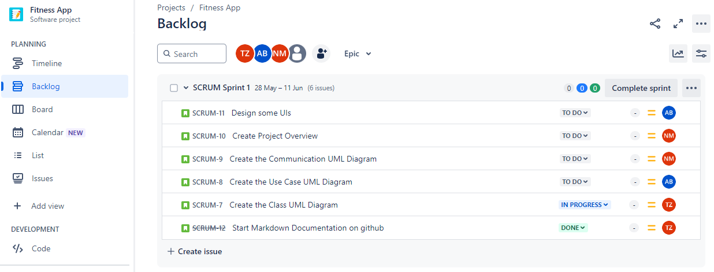
  <br>
  <br>
  Figure 1: Jira
</p>

## 3 Architectural Design

“FitMaster” application is based on the client-server architecture. The client is provided with an interactive React Native-based user interface for managing and tracking workouts, exercises, and personal fitness progress. The server-side processing is enabled using Node.js, Express, and MongoDB. The client requests the server for user-specific workout and exercise data, and the server responds with the relevant information. Additionally, the server allows users to log their exercise data, track their progress over time, and manage their personal profiles. FitMaster aims to provide a comprehensive solution for users to enhance their fitness journey by offering personalized workout plans and progress tracking.

### 3.2 Use Case Diagram

In a use case diagram for a fitness app that logs workouts, the primary actor is the User who interacts with functionalities like logging workouts, viewing workout history, setting goals, tracking progress, and receiving reminders and notifications. The User initiates actions such as entering workout details, setting fitness goals, and monitoring progress through the app. This diagram outlines the essential interactions and functionalities between users and the fitness app system.

<p align="center">
  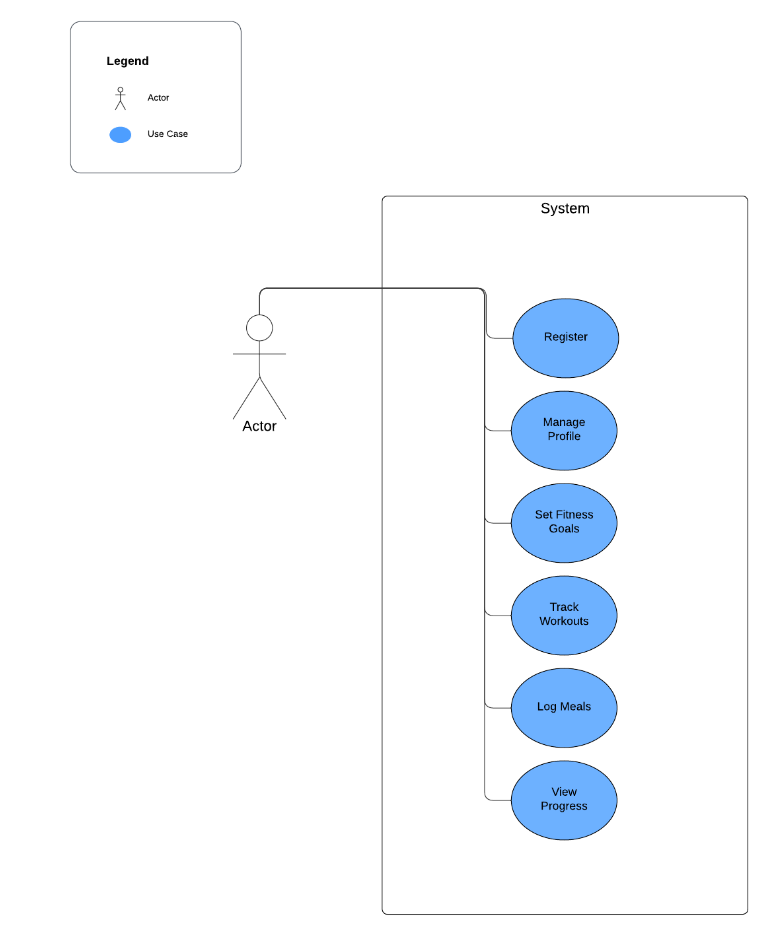
  <br>
  <br>
  Figure 2: Use Case Diagram

### 3.2 Class Diagram

This section contains a single MVC pattern class diagram for our design. The diagram shows the following components:

- Boundary class: FitMasterUI
- Control class: FitMasterController
- Entity classes: User, Workout, MuscleGroup, Exercise, LogEntry

This diagram illustrates the interactions between the user interface, control logic, and data models in the FitMaster application. It provides a comprehensive view of how the various components of the application interact with each other to facilitate user management, workout planning, and exercise logging.

<p align="center">
  
  <br>
  <br>
  Figure 3: Class Diagram
</p>

### 3.3 Sequence Diagram

This section contains the sequence diagram of a user loggin a workout. The will start by creating the workout, choosing a muscle group, addign the exercise, and then it will go back through and display it to the user. Figure 4 displays the diagram.

<p align="center">
  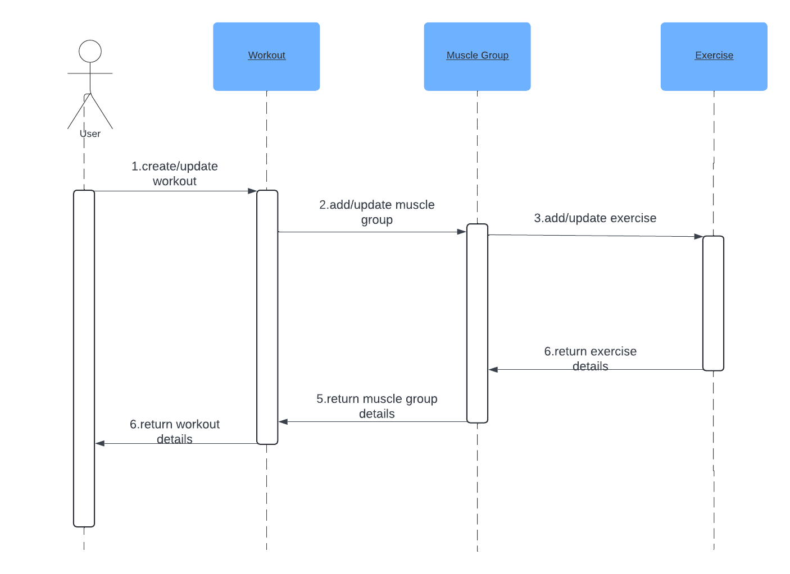
  <br>
  <br>
  Figure 4: Sequence Diagram
</p>

## 4 User Guide/implementation

### 4.1 Client Side

#### 4.1.1 Starting the Application

The user needs to install the “FitMaster” application on their Android-based device. After installation, the icon of the app will appear on the Home Screen of the user’s device. Upon opening the application, the “FitMaster” Home Screen will be displayed.

#### 4.1.2 User Creation

Initially, the user has to register their details with the application for the first time. This is a one-time registration process. The user must enter details such as name, gender, height, weight, and age. Once done, you will also have to option to create additional users if needed.

<p align="center">
  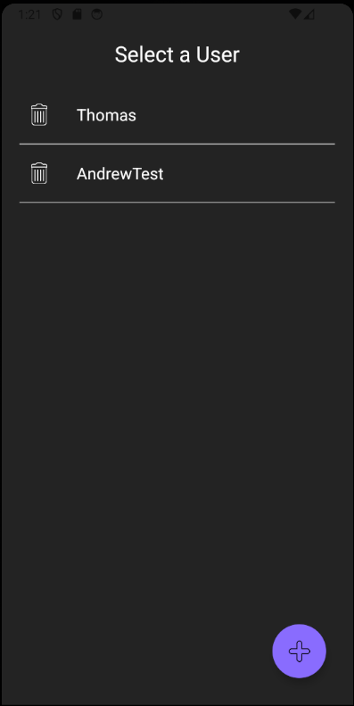
  <br>
  Figure 5: Select User or Create a New User
  <br>
  <br>
  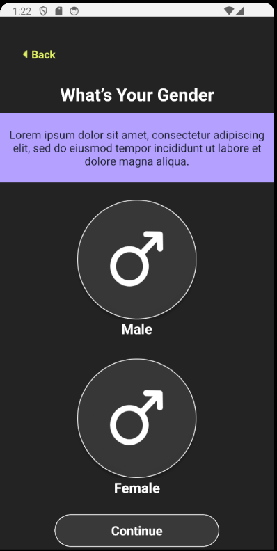
  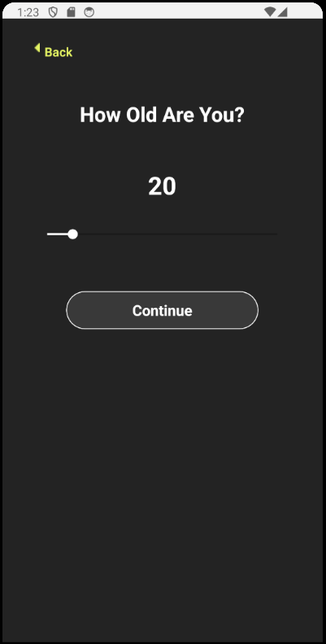
  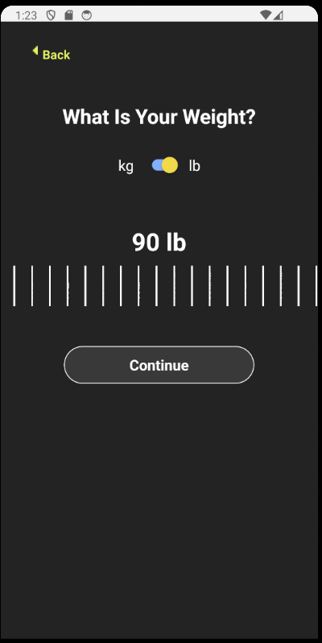
  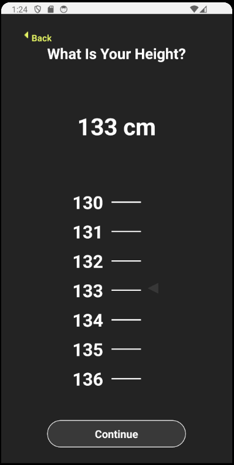
  <br>
  Figure 6: Select Information for User
  <br>
  <br>
  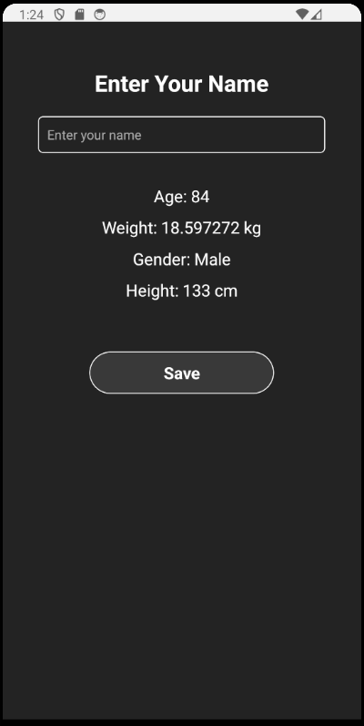
  <br>
  Figure 7: Type Name and Save User
  <br>
</p>

After pressing the save button on the Name Screen, the application validates the input to ensure that a name has been entered. If valid, the user's name, along with other collected details such as age, weight, height, and gender, are updated in the UserContext. This information is then submitted to the server, where it is stored in the database. Upon successful saving, a confirmation message is displayed, and the user is navigated to the User Select screen, where they can see their profile listed and proceed to use the app's features.

### 4.2 Home

From this window user can go to profile information, workout, or Progress Tracking.

<p align="center">
  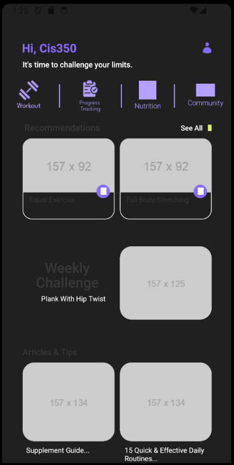
  <br>
  <br>
  Figure 8: Home Sceen
</p>

#### 4.2.1 Profile Screen

Here A user can edit there profile as well as return to the User selection screen to change/add a user.

<p align="center">
  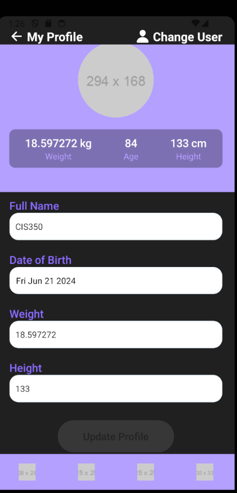
  <br>
  <br>
  Figure 8: Profile Screen
</p>

#### 4.2.2 Workout/Muscle Group Selection

Users can select a Muscle Group from the workout button on the Home screen.

<p align="center">
  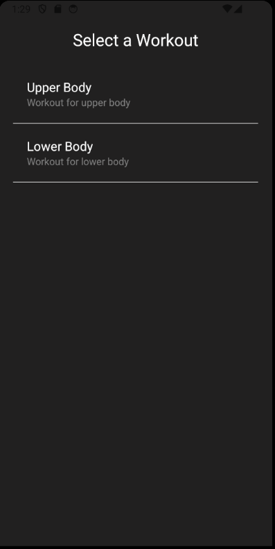
  <br>
  <br>
  Figure 9: Muscle Group Selection
</p>

#### 4.2.3 Exercise Selection

Once a Muscle Group is selected, an exercise for that muscle group can then be selected.

<p align="center">
  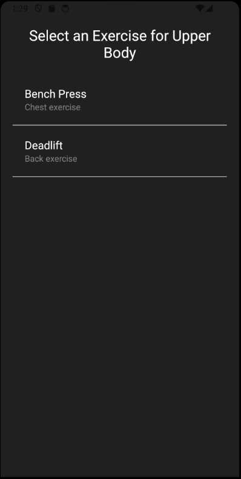
  <br>
  <br>
  Figure 10: Exercise Selection
</p>

#### 4.2.4 Lift Information Log

Next, you will be able to log information about that lift.

<p align="center">
  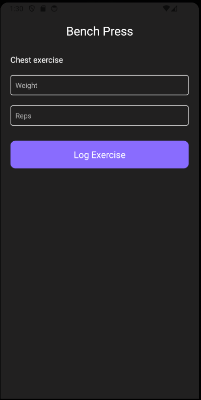
  <br>
  <br>
  Figure 11: Log Lift Screen
</p>

### 4.3 View Logs

When a user wants to view there logs, they can do so from the home screen and selecting Progress Tracking. You will be taken to the Log screen where you can view ur logs which have been grouped by day they were taken.

<p align="center">
  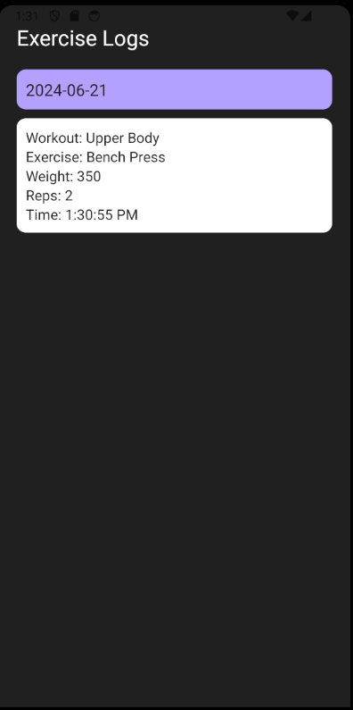
  <br>
  <br>
  Figure 11: View Log Screen
</p>

### 4.4 Server Side

The server side processing for the fitness application is powered by Node.js and MongoDB. The server handles requests from the client side, including user registration, workout selection, exercise logging, and fetching log details. When a new user registers, their information is stored in the MongoDB database. The server processes requests to retrieve available workouts and exercises, ensuring only relevant data is sent back to the client.

When a user logs an exercise, the server receives the details, including the workout, exercise, weight, and reps, and stores this data in the database. The server can also group and fetch logs by day for a user, allowing for detailed tracking of workout progress. The administrator has tools to view and manage user details and log entries directly via the server interface, ensuring efficient data management and user support.

## 5 Risk Analysis and Retrospective

At the start of the project, we were quite ambitious with our goals given the limited time we had. One major risk was the challenge of implementing all desired features within the deadline. A recurring problem was getting the information from the edit screen to save correctly to the currently selected user. We also faced difficulties in associating workouts with each user. To overcome these issues, we relied heavily on searching for similar problems on Google and using ChatGPT for assistance. This approach helped us troubleshoot effectively and keep the project moving forward.

Despite the challenges, we accomplished several key tasks. We successfully created, deleted, and edited users, and implemented a workflow where users could select a workout, choose exercises related to that workout, and log their exercises. These logs were saved to the currently selected user, ensuring that each user had their own unique logs. We also added functionality to view and organize these logs by the day they were created, making it easier for users to track their progress.

One area we could have improved is the user interface (UI). The UI ended up being somewhat disorganized, which is ironic because we spent the most time on setting it up for each screen. With more time and focus on design, we could have created a more cohesive and user-friendly interface.

## 6 Future Scope
There are several enhancements we would like to add to future versions of the fitness application to further improve user experience and functionality. One of the key features we aim to include is the ability to edit exercise logs. This will allow users to correct any mistakes or update information, ensuring the accuracy of their workout records. Additionally, users will have the option to delete logs, giving them better control over their exercise history and enabling more efficient management and organization.

Another enhancement we plan to introduce is the ability to favorite workouts. Users will be able to mark their preferred workouts as favorites and access them quickly through a dedicated section, enhancing convenience and personalization of their fitness routines. Furthermore, we would like to integrate a help section into each exercise, providing instructional videos that demonstrate the correct form and technique. This feature aims to ensure users perform exercises safely and effectively, reducing the risk of injury and maximizing the benefits of their workouts.

## 7 Conclusion

Overall, our fitness app provides the essential tools for anyone wanting to get in shape and track their progress. By letting users log their workouts, exercises, and personal fitness goals, we aim to make staying fit easier and more fun. We hope to keep improving this project with new features and better user experiences, making it even more useful for everyone on their fitness journey. We believe this app can become a great companion for anyone looking to improve their fitness.

## 8 Walkthrough
stuff
